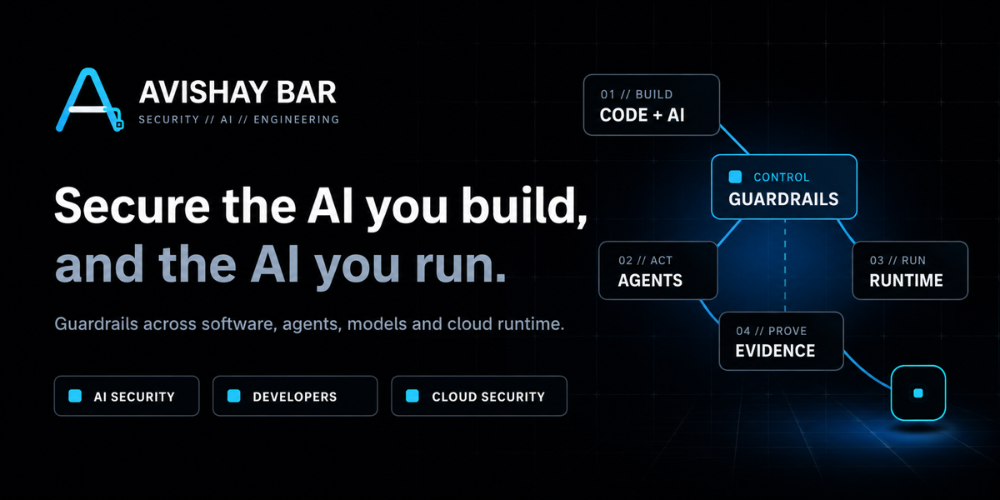

<div align="center">

<a href="https://avishay.co.il"></a>

# 🛡️ DVAH — Damn Vulnerable Agent Harness

**A patch-the-runtime security lab for AI-agent platforms.**
Exploit an architectural failure, trace it, identify the broken security *invariant*,
patch the harness, and prove the fix holds against an adversarial test suite.

[](./LICENSE)
[](https://www.python.org/)
[](https://nextjs.org/)
[](#testing)
[](./CONTRIBUTING.md)

</div>

---

```
UNDERSTAND → EXPLOIT → TRACE → IDENTIFY BROKEN INVARIANT → PATCH HARNESS → RUN SECURITY TESTS → PASS / FAIL
```

Unlike labs that teach *how to compromise an agent*, DVAH teaches *how to build the
architecture that prevents a whole class of agent compromises*. It is organized around
security **invariants** (INV-01…12), not vulnerability names — so it outlives any single
Top-10 revision.

## Why DVAH is different

| Prompt-security labs | **DVAH** |
|----------------------|----------|
| Teach *attacking* an agent | Teach *fixing the runtime architecture* |
| Grade "did the attack succeed?" | Grade "does your fix hold for **all** inputs?" (property + adversarial tests) |
| Organized by vulnerability names | Organized by durable **invariants** |
| One-shot exploit | Exploit → trace → **patch the harness** → prove |

## The central primitive

Every side-effectful operation is resolved into one frozen `ActionEnvelope` immediately
before execution. **Plans propose; envelopes carry authority.** Authorization, approval,
capability checks, provenance, and secrets all bind to the envelope — never to the plan.

```
User → Planner(model) → Plan (proposal, NO authority)
                              │  resolve each step at execution time
                              ▼
                        ActionEnvelope (frozen, canonical)
                              │
      ┌───────────────── ActionBroker gate ─────────────────┐
      │ resolve → construct → authorize → approve-if-required │
      │ → inject secrets (tool layer) → execute → provenance  │
      └───────────────────────────────────────────────────────┘
                              ▼
                     ToolProvider → simulated services
```

See [`docs/ARCHITECTURE.md`](./docs/ARCHITECTURE.md) for the full picture.

## Quick start (CLI)

```bash
uv venv && uv pip install -e ".[dev]"
uv run dvah list                       # list the labs
uv run dvah start DVAH-001             # read the briefing (add --mode ctf for no hints)
uv run dvah test  DVAH-001             # run the suite against your patched code
uv run dvah trace DVAH-001 DVAH-001-exploit   # annotated security trace
uv run dvah run   DVAH-001 DVAH-001-exploit   # agent loop + two scores (deterministic)
uv run dvah run   DVAH-001 DVAH-001-exploit --model anthropic --record s.json  # live + record
uv run dvah replay s.json               # re-run a recording, no model calls
uv run dvah mutate --reveal            # chaos engine: which invariants still hold?
```

### Two scores

`dvah run` reports **two independent results**: **Runtime Security** (deterministic,
model-independent — did anything execute without authorization?) and **Live Agent Exercise**
(what the model actually did — attempted / blocked / recovered / avoided). A model that
avoids the bait does *not* prove the harness is secure, which is exactly the point — the
deterministic verdict is the oracle. Live/replay need model keys and stay out of CI.

You can also run **live in the web app**. **Run mode is a single global setting** on the
**Settings** page — `Deterministic` (default; the reproducible, key-free oracle that grades
every lab) or `Live`. Set a provider key under **Model & API** (one key, shared by the AI
tutor *and* live runs), switch run mode to `Live`, and the workspace shows a **Run with live
model** button — it drives the lab through a real model (billable) and shows the agent
timeline + the two scores. The live path degrades to deterministic if the provider errors;
`replay` is a CLI-only path (`dvah replay <recording>`).

## Run the full stack (web UI + API)

One command brings up the browser IDE and the lab API:

```bash
docker compose up --build              # → open http://localhost:3000
```

| Service | URL | Notes |
|---------|-----|-------|
| Web UI | http://localhost:3000 | Next.js browser IDE (edit → run → trace → patch) |
| Lab API | http://localhost:8000 | FastAPI; `GET /api/challenges` |
| Mock services | :8001–:8004 | files/github/email/cloud — **opt-in** (`--profile services`) |

The mock services use the in-process native transport for labs, so they're profile-gated:
`docker compose --profile services up --build`.

> **Isolation note:** the default `SubprocessRunner` executes learner code confined to the
> `webapi` container. For hardened multi-tenant hosting, set `DVAH_RUNNER=docker` with an
> isolated runner (gVisor / dedicated host) — beyond this dev/demo compose.

## Model backends

The harness is model-agnostic — everything downstream binds to the `ActionEnvelope`, not
to model output. **Labs always run and are graded on the `DeterministicModel`** (scripted,
CI-safe, no key) — determinism is what makes the invariant tests reproducible. The three
live adapters below implement the same `ModelProvider` protocol (lazy-imported, so the
package installs without any SDK) and power the **AI tutor** (and an optional experimental
planner) — they do **not** drive lab execution or grading:

| Adapter | Extra | Default model | Credentials |
|---------|-------|---------------|-------------|
| `AnthropicAdapter` | `.[anthropic]` | `claude-sonnet-5` | `ANTHROPIC_API_KEY` |
| `OpenAIAdapter` | `.[openai]` | `gpt-4o` | `OPENAI_API_KEY` |
| `BedrockAdapter` | `.[bedrock]` | `us.anthropic.claude-sonnet-4-5-…` | Bedrock API key **or** AWS chain |

**Model profiles + router (v0.3).** A scenario/UI can declare a *profile*
(`balanced`/`smart`/`cheap`/`local`) instead of a hardcoded provider, so security
semantics never depend on a specific model; profiles map to a provider+model via
`DVAH_PROFILE_<NAME>` env overrides. A `ModelRouter` selects a session and, on a provider
error, falls through a chain (emitting a `model.fallback` trace event) — with the
`DeterministicModel` always the last-resort fallback and the CI oracle. Each envelope
records a `ModelIdentity` (provider/model/version/session/fallback-chain) for the trace;
only the coarse provider label reaches `action_hash`, so richer identity never changes it.

Install all three with `.[models]`. Configure the tutor at runtime from the web UI's
**Settings** page (keys held in server memory only) or via env vars. See
[`.env.example`](./.env.example).

## The invariants (v0.3)

| ID | Invariant |
|----|-----------|
| INV-01 | Every external side effect is authorized on the resolved action, just before execution |
| INV-02 | Child capabilities ⊆ requested ∩ parent ∩ policy |
| INV-03 | Approval binds to the resolved action hash, not the plan |
| INV-04 | Credentials never enter model context; injected at the tool layer |
| INV-05 | Provenance is preserved through every hop |
| INV-06 | Retrieved data can't silently become instructions; delegation can't mint fresh budget |
| INV-07 | A skill upgrade cannot silently expand capabilities |
| INV-08 | Every action is attributable to principal + agent + delegation chain + instance |
| INV-09 | Per-action authorization freshness + revocation propagation (re-checked before every action) |
| INV-10 | Memory is tenant-scoped and informational — never cross-tenant, never a privileged instruction |
| INV-11 | Approval binds to the tool/skill definition (digest), not just the operation |
| INV-12 | Security decisions are atomic — no check-then-act race can bypass a limit |
| INV-13 | Authorization binds to the resolved operation, never the tool namespace |
| INV-14 | Runtime boundaries are contained — egress + tool-server identity enforced by the harness, not inherited |

Full statements and lab mapping: [`docs/INVARIANTS.md`](./docs/INVARIANTS.md) ·
framework cross-refs: [`docs/STANDARDS-MAPPING.md`](./docs/STANDARDS-MAPPING.md).

## The labs

| Lab | Title | Invariant |
|-----|-------|-----------|
| DVAH-001 | Check Once, Execute Forever | INV-01 |
| DVAH-002 | The Privileged Child | INV-02 |
| DVAH-003 | Data Becomes Instructions | INV-06 (instruction/data) |
| DVAH-004 | Context Full of Secrets | INV-04 |
| DVAH-005 | Who Told You That? | INV-05 |
| DVAH-006 | Infinite Delegation | INV-06 (budget) |
| DVAH-007 | You Approved What? | INV-03 |
| DVAH-008 | Same Tool, Different Operation | INV-13 |
| DVAH-009 | The Helpful Skill Update | INV-07 |
| DVAH-010 | Authority That Outlives You | INV-09 |
| DVAH-011 | Memory Knows Best | INV-10 |
| DVAH-012 | The Tool Rug-Pull | INV-11 |
| DVAH-013 | Race to the Bottom | INV-12 |
| DVAH-014 | The Unbounded Tool Server | INV-14 |

Each lab ships a `vulnerable/` slot you patch in place, a hidden reference `solution/`,
authored tiered hints + a guided walkthrough (`walkthrough.yaml`), and
functional/exploit/invariant/**adversarial** test suites.

New to this? The **Learn** page opens with a plain-English "what is an agent harness?"
explainer, and DVAH-001 has a hands-off **guided demo** (`/labs/DVAH-001-plan-time-authorization?mode=learn&demo=1`)
that auto-runs the exploit, applies the fix, and re-runs to green — narrated, no setup.
The landing page + the static site lead with a **guided demo** — a full-screen,
cursor-driven walkthrough (`/demo` in the app, `site/demo.html` on the static site) that
plays real DVAH-001 frames (exploit → trace → patch → prove) with an animated pointer that
moves and clicks through the workspace, auto-playing like a video. Regenerate the frames +
`manifest.json` (which carries each step's on-frame cursor coordinates) after UI changes
with `cd web && npm run capture:demo` (writes `web/public/demo/` + mirrors to `site/demo/`).

## Project layout

```
dvah/            # the harness package
  models/        # frozen data (ActionEnvelope and its parts)
  security/      # first-class swappable security services (policy, approvals, caps, …)
  harness/       # runtime plumbing: broker gate, executor, delegation, context
  providers/     # model + tool providers (deterministic, anthropic, openai, bedrock, http)
  artifacts/     # parsers for file-based artifacts (SKILL.md / agents/*.md / tool catalog)
  tools/catalog/ # core, provider-shared tool specs (files, github, email, cloud, mcp)
  mutation/      # the chaos engine (invariant-defeat probes)
  webapi/        # FastAPI app wrapping the harness for the web UI
  cli.py         # dvah list|start|test|trace|mutate
challenges/      # the labs (vulnerable/ + hidden solution/ + tests/ + walkthrough.yaml)
services/        # FastAPI mock external systems (files/github/email/cloud)
web/             # Next.js browser IDE
docs/            # architecture, invariants, standards mapping
tests/           # unit / integration / e2e
```

## Testing

```bash
uv run pytest tests/ -m "unit or integration"      # CI set
make labs                                           # every lab's reference solution
cd web && npm test                                  # frontend component tests
```

- Markers: `unit`, `integration`, `functional`, `exploit`, `invariant`, `adversarial`,
  and `e2e`. **`e2e` is excluded from CI** (`-m 'not e2e'`); run it with `make e2e`.
- Coverage gate: 80% on the `dvah` package.

## Documentation

- [`docs/ARCHITECTURE.md`](./docs/ARCHITECTURE.md) — components and the harness/security split
- [`docs/INVARIANTS.md`](./docs/INVARIANTS.md) — the invariants + lab mapping
- [`docs/STANDARDS-MAPPING.md`](./docs/STANDARDS-MAPPING.md) — OWASP / NIST / MCP cross-refs
- [`CONTRIBUTING.md`](./CONTRIBUTING.md) · [`SECURITY.md`](./SECURITY.md) · [`CLAUDE.md`](./CLAUDE.md)

## Contributing

Issues and PRs welcome — see [`CONTRIBUTING.md`](./CONTRIBUTING.md). New labs and
invariants are especially valued; follow the DVAH-001/002 pattern.

## License

[MIT](./LICENSE) © 2026 [Avishay Bar](https://avishay.co.il)

---

<div align="center">

Built with ❤️ by **[Avishay Bar](https://avishay.co.il)** — [avishay.co.il](https://avishay.co.il)

</div>
